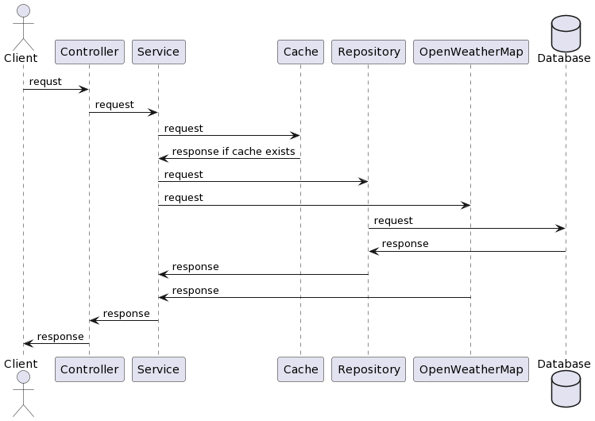
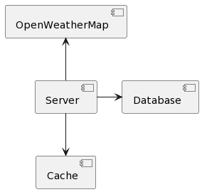

# Pet Project

This application helps you keep track of the weather.
You can use it by visiting 'http://localhost:8080' and creating an account.

## Sequence diagram

## Component diagram

Main application communicates with cache (we use Redis), database (we use Postgresql), api (we use OpenWeatherMap)

## Class diagram

We have two main classes - **User** and **Location**.

**User** class represents user in this application. The user can log in, add cities and view the temperature.

User can have roles - `ROLE_USER` or `ROLE_ADMIN`.

**Location** class represents the coordinates of a location added by the user.

## Environments

To run this application you need to create `.env` file in root directory with next environments:

- `POSTGRES_HOST` - host of Postgresql database
- `POSTGRES_USERNAME` - username for Postgresql database
- `POSTGRES_PASSWORD` - password for Postgresql database
- `DATABASE_NAME` - name of Postgresql database
- `DATABASE_SCHEMA` - name of Postgresql schema
- `REDIS_HOST` - host of Redis instance
- `REDIS_PASSWORD` - password for Redis
- `WEATHER_API_KEY` - api key from OpenWeatherMap